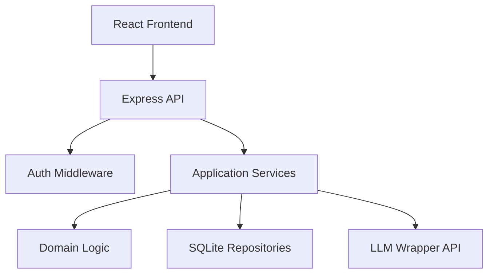

# Financial Wellness & Tax AI Agent

An AI-powered employee financial wellness assistant that explains payslips, payroll data, deductions, and basic tax-saving opportunities — grounded in **your data only**.

---

## Part A — Non-Technical Overview

### What is this?

Employees often struggle to read payslips. Salary components (HRA, LTA, PF), deductions (TDS, professional tax), and year-to-date values are shown in compact formats. HR and Finance teams get repeated questions.

This app gives each employee a **private assistant** that:

- Explains their salary in **simple English**
- Answers questions like *"Why is my net pay lower?"* using **their payslip and payroll records**
- Runs **basic tax-saving what-if** scenarios (e.g. extra Section 80C investment)
- Shows a **checklist** of investment proofs still needed

### Who is it for?

- **Employees** — understand payslips and plan tax savings
- **HR / Finance** — reduce repetitive payroll queries (future: admin audit view)

### What it does NOT do

- It is **not** legal or tax advice
- It does **not** replace your payroll system
- It uses **simplified tax rules** for demonstration
- Production compliance (SOC2, full encryption, certified OCR) is **out of scope** for this prototype

### Privacy in plain English

Your payslip and salary data belong to **you**. The system is designed so one employee cannot see another employee's data. AI answers use only **your** uploaded documents and payroll records.

### Demo accounts

| Email | Role |
|-------|------|
| `employee1@company.com` | Employee (pending proofs) |
| `employee2@company.com` | Employee (all proofs done) |
| `admin@company.com` | Admin (audit logs only) |

---

## Part B — Technical Overview

### Architecture



**Layered monolith** — one backend, clear module boundaries:

| Layer | Folder | Responsibility |
|-------|--------|----------------|
| Routes | `backend/src/routes/` | Thin HTTP handlers |
| Services | `backend/src/services/` | Use-case orchestration |
| Domain | `backend/src/domain/` | Tax math, payslip validation, AI context |
| Infrastructure | `backend/src/infrastructure/` | LLM client, file storage |
| Repositories | `backend/src/repositories/` | DB access (always scoped by `userId`) |

**Key design rule:** Numbers and tax calculations live in **domain code** (unit tested). The LLM only **explains** pre-loaded context — it never invents salary figures.

### AI grounding strategy

1. Build JSON context from user's payslips + payroll + declarations
2. Send context + question to LLM with strict rules (see `chatService.ts`)
3. Refuse prompt injection and missing-data cases in code
4. Attach **source citations** where possible (HRA, net pay, etc.)

### Security model

| Control | Prototype | Production evolution |
|---------|-----------|----------------------|
| Authentication | JWT (demo login by email) | SSO / OIDC |
| Authorization | `userId` from token only; body `userId` ignored | Policy engine |
| Data isolation | All queries filter `WHERE user_id = ?` | Row-level security |
| LLM token | Server env only | Secret manager |
| File upload | Type + size validation | AV scan, content inspection |
| Audit | Action logs without PII | SIEM integration |

### Tax simulation assumptions

- Simplified **new regime** slabs (see `domain/tax/constants.ts`)
- Standard deduction: ₹50,000
- Section 80C cap: ₹1,50,000
- Annual gross projected from payroll YTD if fewer than 12 months

### Known limitations

- OCR accuracy depends on LLM wrapper quality
- SQLite is not for high-concurrency production
- Simulated auth — not enterprise SSO
- Tax rules are illustrative only

---

## Part C — Run Locally

### Prerequisites

- Node.js 18+
- npm

### Backend

```bash
cd backend
cp .env.example .env
# Edit .env — set JWT_SECRET and LLM_API_TOKEN if using real LLM

npm install
npm run seed
npm run dev
```

Server runs at `http://localhost:3001`

Set `USE_MOCK_LLM=true` in `.env` to avoid calling the real LLM API during development.

### Frontend

```bash
cd frontend
cp .env.example .env
npm install
npm run dev
```

App runs at `http://localhost:5173`

---

## Part D — Deploy

### Backend (Railway / Render / Fly.io)

1. Deploy `backend/` as Node app
2. Set environment variables:
   - `PORT`, `JWT_SECRET`, `LLM_API_URL`, `LLM_API_TOKEN`
   - `CORS_ORIGIN` = your frontend URL
   - `USE_MOCK_LLM=false` for production AI
   - `NODE_ENV=production`
3. Run `npm run seed` once on deploy (or via release command)
4. Use persistent volume for `data/` and `uploads/` if needed

### Frontend (Vercel / Netlify)

1. Deploy `frontend/`
2. Set `VITE_API_URL` to your backend URL
3. Build command: `npm run build`
4. Output: `dist`

**Never** put `LLM_API_TOKEN` in frontend env vars.

---

## Expected deliverables (assignment mapping)

| Deliverable | Location |
|-------------|----------|
| Working demo (upload/OCR, payroll, AI chat, tax sim) | `frontend/` + `backend/` — run via `start.bat` or Part C below |
| Layered structure (models, OCR, payroll, AI, security, UI) | See [Project structure](#project-structure) and `backend/src/` |
| AI prompts (grounding, refusal, sources) | `backend/src/domain/ai/prompts.ts`, `guardrails.ts`, `contextBuilder.ts` |
| Setup & architecture docs | This README + **`docs/HOW_TO_RUN_AND_DEMO.md`** (PDF: `docs/HOW_TO_RUN_AND_DEMO.pdf`) |
| Edge cases & tests | **`docs/EDGE_CASES.md`** + `backend/tests/` (41 automated tests) |

**Full demo guide (PDF):** open `docs/HOW_TO_RUN_AND_DEMO.pdf` or generate with:

```bash
npx --yes md-to-pdf docs/HOW_TO_RUN_AND_DEMO.md
```

---

## Part E — Testing

```bash
cd backend
npm test                 # all tests
npm run test:unit        # domain logic
npm run test:integration # API + DB
npm run test:security    # SEC-01 to SEC-12
```

See **`docs/EDGE_CASES.md`** for missing fields, unauthorized access, inconsistent OCR, and tax assumptions.

### Security tests (SEC-01 – SEC-12)

| ID | Scenario |
|----|----------|
| SEC-01 | Cross-user payslip access blocked |
| SEC-02 | Body `userId` ignored |
| SEC-03 | No token → 401 |
| SEC-04 | Invalid JWT → 401 |
| SEC-05 | Payroll scoped per user |
| SEC-06 | LLM context has no other user data |
| SEC-07 | Bad file type rejected |
| SEC-08 | Oversized file rejected |
| SEC-09 | SQL injection in params handled |
| SEC-10 | Prompt injection refused |
| SEC-11 | Audit logs exclude salary PII |
| SEC-12 | Secrets not in API responses |

---

## Part F — API Reference

| Method | Endpoint | Auth | Description |
|--------|----------|------|-------------|
| GET | `/health` | No | Health check |
| POST | `/auth/login` | No | Login with email |
| GET | `/payroll/months` | Yes | List payroll months |
| GET | `/payroll/months/:month` | Yes | Month detail |
| GET | `/payroll/ytd` | Yes | Year-to-date totals |
| GET | `/payroll/compare?from=&to=` | Yes | Compare two months |
| GET | `/payslips` | Yes | List payslips |
| GET | `/payslips/:id` | Yes | Get payslip |
| POST | `/payslips/upload` | Yes | Upload payslip |
| GET | `/tax/declaration` | Yes | Tax declaration |
| POST | `/tax/simulate` | Yes | Tax what-if |
| GET | `/checklist` | Yes | Proof checklist |
| POST | `/chat/ask` | Yes | Grounded AI Q&A |
| GET | `/audit` | Admin | Audit logs |

---

## Project structure

```
├── backend/
│   └── src/
│       ├── models/           # Data types
│       ├── domain/           # Pure logic (tax, payslip, AI context)
│       │   ├── ai/           # Prompts, guardrails, context builder
│       │   ├── payslip/      # OCR normalization & validation
│       │   ├── payroll/      # YTD, month comparison
│       │   └── tax/          # Deterministic tax simulation
│       ├── services/         # Use-case orchestration
│       ├── repositories/     # SQLite (user-scoped queries)
│       ├── infrastructure/   # LLM client, file storage
│       ├── middleware/       # Auth, rate limit
│       └── routes/           # HTTP API
├── frontend/         # React UI (dashboard, upload, chat, tax)
├── docs/
│   ├── HOW_TO_RUN_AND_DEMO.md   # Setup & demo script (source for PDF)
│   ├── HOW_TO_RUN_AND_DEMO.pdf  # Printable guide
│   └── EDGE_CASES.md            # Documented edge cases
├── README.md
└── start.bat         # One-click Windows setup
```

---

## Trade-offs

| Choice | Why |
|--------|-----|
| SQLite | Zero setup for demo; swap to Postgres later |
| Mock LLM default | Fast local dev; real API when token set |
| Monolith | Simpler than microservices for prototype |
| JWT in localStorage | Simple demo; production should use HttpOnly cookies |

---
